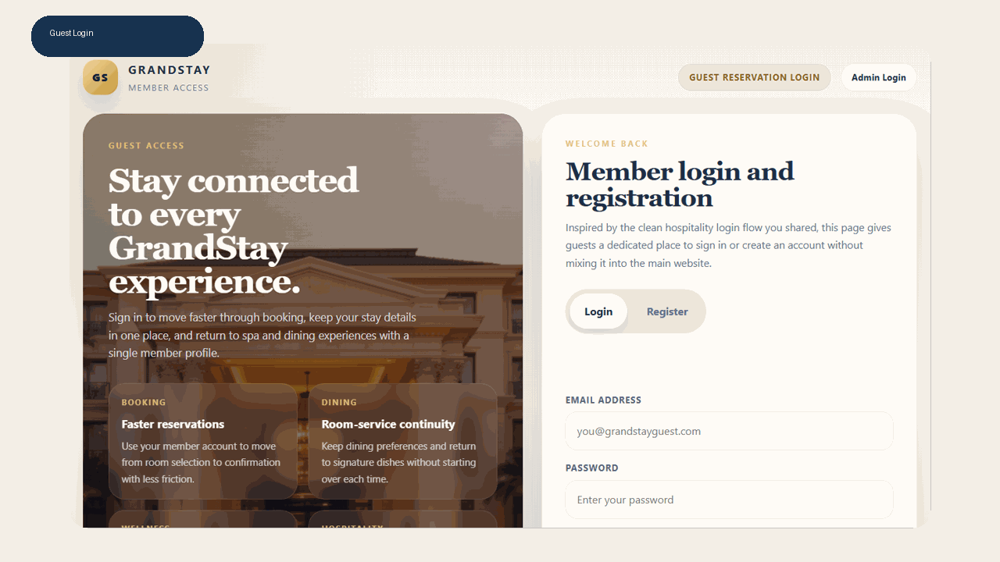
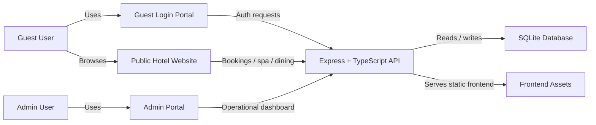

<h1 align="center">GrandStay Hotel Management System</h1>

<p align="center">
  Professional full-stack hotel booking and operations platform with guest authentication,
  room reservations, spa appointments, dining orders, and a dedicated admin control room.
</p>

<p align="center">
  
  
  
  
  
</p>

## Live Product Snapshot



## Overview

GrandStay is designed as a polished hospitality platform with clearly separated guest and admin experiences. Guests can register, sign in, browse rooms, reserve stays, book spa services, and place dining orders. Hotel staff can sign into a dedicated admin portal to monitor bookings, food orders, and spa appointments from a focused operations dashboard.

The project is structured as a professional full-stack application with:

- a dedicated `frontend/` for the public website and auth portals
- a TypeScript `backend/` API for business logic and persistence
- SQLite for local development storage
- separate guest and admin authentication flows
- Windows launch scripts for simple local startup

## Core Features

| Area | What It Includes |
|---|---|
| Guest Portal | Dedicated `/login` page with `Login` and `Register` tabs |
| Admin Portal | Separate `/admin` route with booking, dining, and spa oversight |
| Rooms | Availability lookup, reservation creation, pricing and room selection |
| Spa | Service browsing, appointment scheduling, and admin-side visibility |
| Dining | Menu browsing, food ordering, and admin order management |
| Auth | JWT-based guest and admin authentication |
| Backend | TypeScript + Express API with SQLite persistence |
| UX | Hospitality-inspired, professional portal design |

## Screenshots

| Guest Portal | Guest Portal Mobile |
|---|---|
|  |  |

| Admin Portal |
|---|
|  |

## Architecture



## User Experience

### Guest Experience

- Guests can create a member account from `/login`
- Returning users can sign in and continue their hotel journey
- The public website stays clean and guest-focused

### Admin Experience

- Admins use a dedicated route at `/admin`
- The admin dashboard shows room bookings, food orders, and spa appointments
- Operational access is kept separate from the marketing and booking UI

## Tech Stack

| Layer | Stack |
|---|---|
| Frontend | HTML, CSS, JavaScript |
| Backend | Node.js, Express, TypeScript |
| Database | SQLite |
| Authentication | JWT |
| Runtime | `tsx` |
| Testing / Verification | `tools/run-final-test.js` |

## Quick Start

### 1. Install backend dependencies

```powershell
npm run backend:install
```

### 2. Start the app

```powershell
npm run dev
```

Or use the Windows launchers:

- `START_SERVER.bat`
- `START_SERVER.ps1`
- `START_PROJECT.bat`

### 3. Open the app

- Public website: `http://localhost:5001`
- Guest login: `http://localhost:5001/login`
- Admin portal: `http://localhost:5001/admin`

## Default Admin Credentials

For local development, the backend seeds a default admin account:

- Email: `admin@grandstayhotel.com`
- Password: `Admin@12345`

These values can be changed in your backend environment configuration.

## Environment Variables

The main local environment file lives in `backend/.env`. A template is available in `backend/.env.example`.

| Variable | Purpose | Default |
|---|---|---|
| `PORT` | API and frontend serving port | `5001` |
| `NODE_ENV` | Runtime mode | `development` |
| `API_VERSION` | API version string | `3.0.0` |
| `SQLITE_DATABASE_PATH` | SQLite database file path | `backend/storage/grandstay.sqlite` |
| `JWT_SECRET` | JWT signing secret | local development placeholder |
| `JWT_EXPIRES_IN` | JWT expiry duration | `7d` |
| `CORS_ORIGIN` | Allowed frontend origin | `http://localhost:5001` |
| `FRONTEND_URL` | Frontend URL reference | `http://localhost:5001` |
| `ADMIN_NAME` | Seeded admin display name | `GrandStay Admin` |
| `ADMIN_EMAIL` | Seeded admin login email | `admin@grandstayhotel.com` |
| `ADMIN_PASSWORD` | Seeded admin password | `Admin@12345` |

## Verification

Run the main checks with:

```powershell
npm --prefix backend run typecheck
node tools/run-final-test.js
```

## API Highlights

### Authentication

- `POST /api/auth/register`
- `POST /api/auth/login`
- `GET /api/auth/me`

### Rooms and Bookings

- `GET /api/rooms`
- `GET /api/bookings`
- `POST /api/bookings`

### Spa

- `GET /api/spa/services`
- `GET /api/spa/availability`
- `POST /api/spa/bookings`
- `GET /api/spa/admin/bookings`

### Dining

- `GET /api/food/menu`
- `POST /api/food/orders`
- `GET /api/food/admin/orders`

### Other Modules

- contact management
- reviews
- payment flows

## Deployment

GrandStay is simple to deploy because the backend serves the frontend assets directly. In production, you only need to host the Node.js backend process and point it at the right environment variables.

### Production deployment checklist

1. Provision a server or Node-compatible hosting environment.
2. Copy the project files and install dependencies.
3. Create `backend/.env` with production values.
4. Set a strong `JWT_SECRET`.
5. Point `SQLITE_DATABASE_PATH` to your persistent storage location.
6. Start the backend with `npm run start`.
7. Expose the application on your desired domain or reverse proxy.

### Example production start

```powershell
npm run backend:install
npm run start
```

## Project Structure

```text
frontend/
  admin/               Admin login + operations dashboard
  login/               Guest login + registration portal
  images/              Visual assets and hospitality imagery
  scripts/             Frontend runtime scripts
  styles/              Shared and portal-specific styles
  index.html           Public website

backend/
  src/config/          Environment and configuration
  src/db/              Database bootstrap
  src/lib/             Data access and domain utilities
  src/middleware/      Auth and error handling
  src/routes/          API route modules
  src/types/           Shared domain types
  src/utils/           Helpers and utilities
  data/                Static seed and catalog data
  storage/             Local SQLite database

scripts/windows/       Windows startup helpers
tools/                 Smoke test scripts
screenshots/           README visual assets
```

## Contributing

Contributions are welcome. If you want to improve the UI, add features, or strengthen the backend:

1. Fork the repository.
2. Create a feature branch.
3. Make your changes.
4. Run the verification commands.
5. Open a pull request with a clear summary.

You can also read the contribution notes in [CONTRIBUTING.md](CONTRIBUTING.md).

## License

This project is released under the MIT License. See [LICENSE](LICENSE) for details.

## GitHub About Text

If you want to reuse the short GitHub repository description:

> Professional full-stack hotel booking platform with guest login, admin dashboard, room reservations, spa appointments, dining orders, TypeScript backend, and SQLite persistence.
