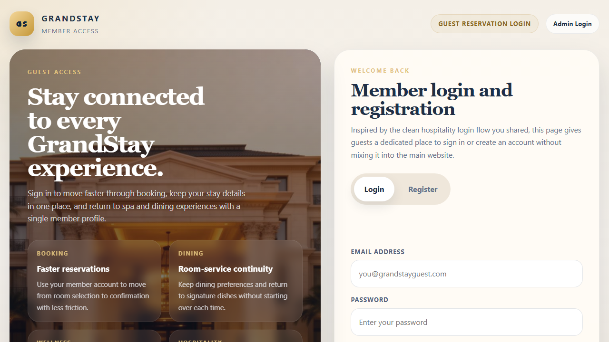
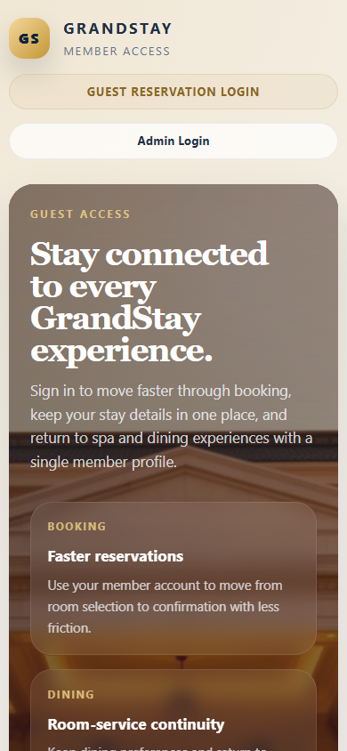
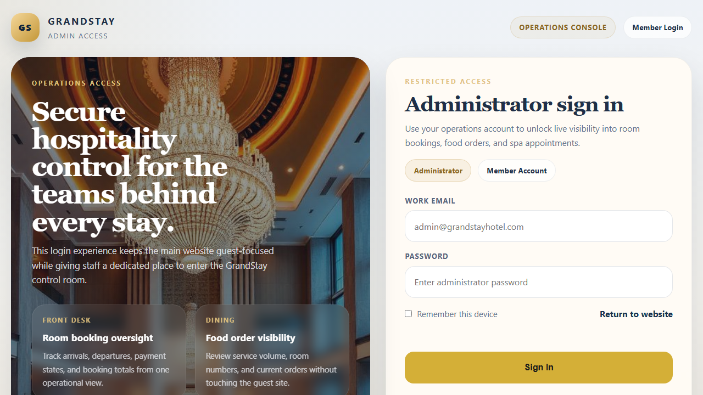

# GrandStay Hotel Management System

GrandStay is a professional full-stack hotel booking and operations platform built with a dedicated frontend, a TypeScript backend, and SQLite for local persistence. It includes guest authentication, room reservations, spa appointment booking, dining order management, and a separate admin portal for hotel operations.

## GitHub Description

Professional full-stack hotel booking platform with guest login, admin dashboard, room reservations, spa appointments, dining orders, TypeScript backend, and SQLite persistence.

## Features

- Guest member portal with dedicated `Login` and `Register` flows
- Separate admin login and operations dashboard
- Room booking and live availability checks
- Spa service browsing and appointment booking
- Dining menu and food order management
- JWT-based authentication for guest and admin access
- TypeScript backend with SQLite persistence
- Professional hospitality-style frontend inspired by real hotel UX patterns

## Screenshots

### Guest Login Portal



### Guest Login Mobile View



### Admin Portal



## Project Structure

```text
c:\new hotel\
|-- frontend\
|   |-- admin\
|   |   `-- index.html
|   |-- login\
|   |   `-- index.html
|   |-- index.html
|   |-- styles\
|   |   |-- admin.css
|   |   |-- auth-portal.css
|   |   `-- main.css
|   |-- scripts\
|   |   |-- app.js
|   |   |-- images-config.js
|   |   |-- site-admin.js
|   |   |-- site-auth.js
|   |   |-- site-booking-spa.js
|   |   |-- site-core.js
|   |   `-- site-dining.js
|   `-- images\
|-- backend\
|   |-- src\
|   |   |-- config\
|   |   |-- db\
|   |   |-- lib\
|   |   |-- middleware\
|   |   |-- routes\
|   |   |-- types\
|   |   `-- utils\
|   |-- data\
|   |-- logs\
|   `-- storage\
|-- screenshots\
|-- scripts\
|   `-- windows\
|-- tools\
|-- package.json
`-- README.md
```

## Run Locally

Start everything from the project root:

```powershell
npm run dev
```

Or use the Windows launchers:

- `START_SERVER.bat`
- `START_SERVER.ps1`
- `START_PROJECT.bat`

The app runs at `http://localhost:5001`.

## Access

### Guest Portal

- URL: `http://localhost:5001/login`
- Returning guests can sign in from the login tab
- New guests can register directly from the register tab

### Admin Portal

- URL: `http://localhost:5001/admin`
- Email: `admin@grandstayhotel.com`
- Password: `Admin@12345`

These admin defaults are seeded from `backend/.env` for local development and can be changed there.

## Tech Stack

- Frontend: HTML, CSS, JavaScript
- Backend: Node.js, Express, TypeScript
- Database: SQLite
- Authentication: JWT
- Tooling: tsx, Playwright screenshots, Windows startup scripts

## Notes

- The backend keeps room, booking, spa, dining, contact, review, auth, and payment data in one local SQLite database.
- `backend/storage/` and `backend/.env` are intentionally ignored from git for safety.
- The current source of truth for local startup is this README plus the root launcher scripts.
